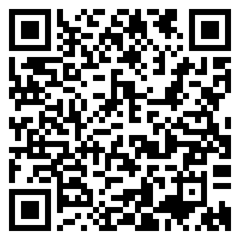

# Fediverse QR Reader

リアル上でユーザーID交換するのめんどくさいと思って作った

相手側のユーザーページのQR(例:`https://koliosky.com/@Kur0den0010`)を読み取ることであらかじめ指定したインスタンスのそのユーザのページに飛べるやつ

↓https://koliosky.com/@Kur0den0010 のQRコード

ユーザーページのURLが`xxx.com/@username`みたいな感じのアプリなら多分対応してる

Misskey/Mastodon/Firefishは確認済みなはず

6時間クオリティ

## License
